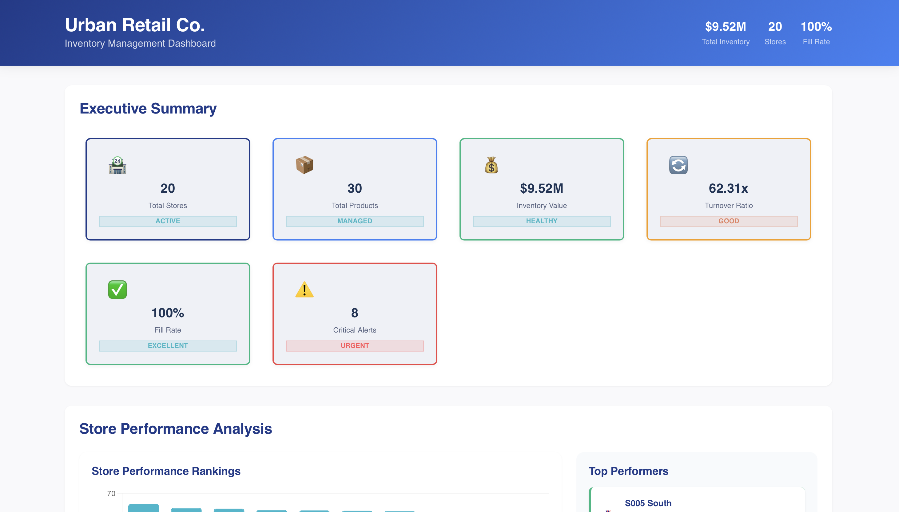
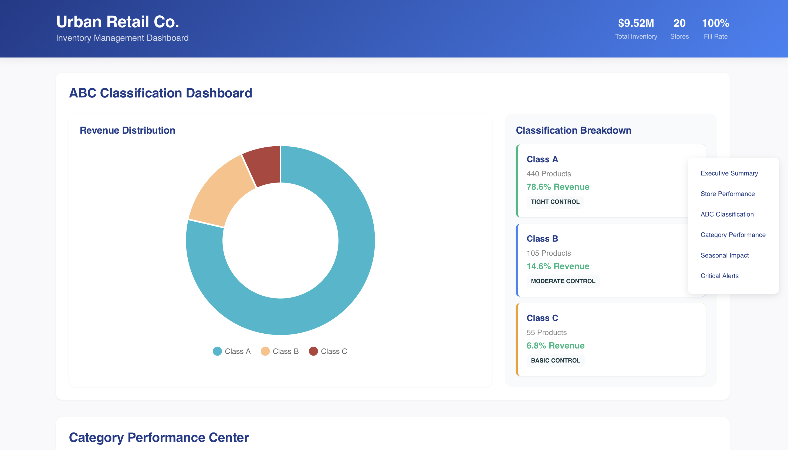
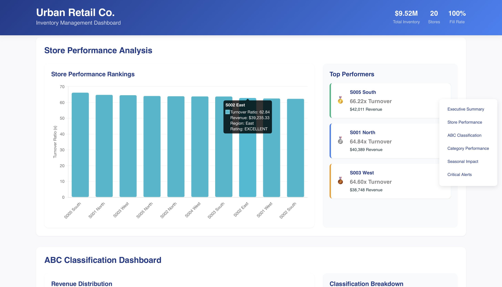

# 📦 Intelligent Inventory Optimization with SQL & Live Dashboards

This project presents a full-stack data analytics solution designed to address inventory inefficiencies across a multi-location retail network. It leverages a normalized SQL schema for robust data management, insightful analytics through SQL views, and a responsive frontend dashboard for real-time performance tracking.

---

## 🌐 Live Inventory Dashboard

Explore the interactive, data-powered dashboard hosted separately here:

🔗 [UrbanCo Inventory Intelligence Dashboard](https://adyasa2004.github.io/reimagined-octo-chainsaw/)  
*(Built on a lightweight JS+JSON frontend for seamless visualization)*

---

## 🧩 System Components

- **Relational SQL Schema** — Modular structure featuring `stores`, `products`, `inventory_data`, and KPI models, optimized via composite keys and indexes.
- **End-to-End ETL in SQL** — Ingests raw CSVs, cleans and normalizes data, performs validation, and generates dynamic business KPIs.
- **Analytics-Ready Views** — Strategic SQL views including:
  - `vw_stock_levels_realtime`
  - `vw_turnover_metrics`
  - `vw_abc_segmentation`
  - `vw_seasonal_trends`
  - `vw_storewise_efficiency`
- **Executive Dashboards** — Summarized strategic insights for decision-makers: alerts, ROI estimates, and category performance.

---

## 🔍 Business Insights Delivered

- Forecast-driven **reorder alerts** to avoid stockouts
- Turnover heatmaps across SKUs and regions
- ABC classification for targeted inventory strategies
- **Seasonality modeling** with event/weather correlation
- Critical alerting and risk prioritization

---

## 📂 Project Resources

- 📘 **[SQL Schema & View Documentation](./sql-documentation.docx)** — Full breakdown of tables, relationships, and queries  
- 📊 **[Executive Summary Report](./Executive%20Report%20(Insights%20and%20Recommendations).docx)** — Non-technical stakeholder-facing presentation  
- 🗺️ **[Entity Relationship Diagram](./ERD.pdf)** — Visual layout of database architecture

---

## 🛠️ Tech Stack

- **Database:** MySQL 8.0+
- **Query Layer:** Analytical SQL (Views, Joins, Aggregates)
- **Frontend:** HTML/CSS + Chart.js
- **Data Exchange:** JSON-based interface

---

## 👤 Ownership & Usage

This project is a self-initiated academic and portfolio showcase by Adyasa Mohapatra.  
For review, learning, or non-commercial referencing only. Please contact before reuse.

---

## 💡 Want to Collaborate?

Open to feedback and future development! For suggestions, improvements, or academic discussion, feel free to raise an issue or connect directly.

Connect at m.adyasa@iitg.ac.in 

